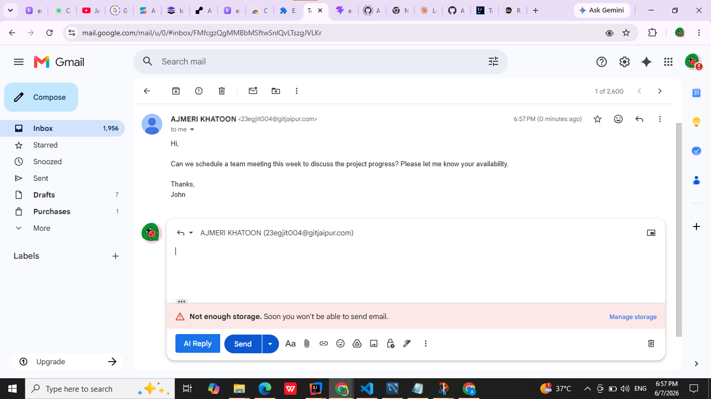
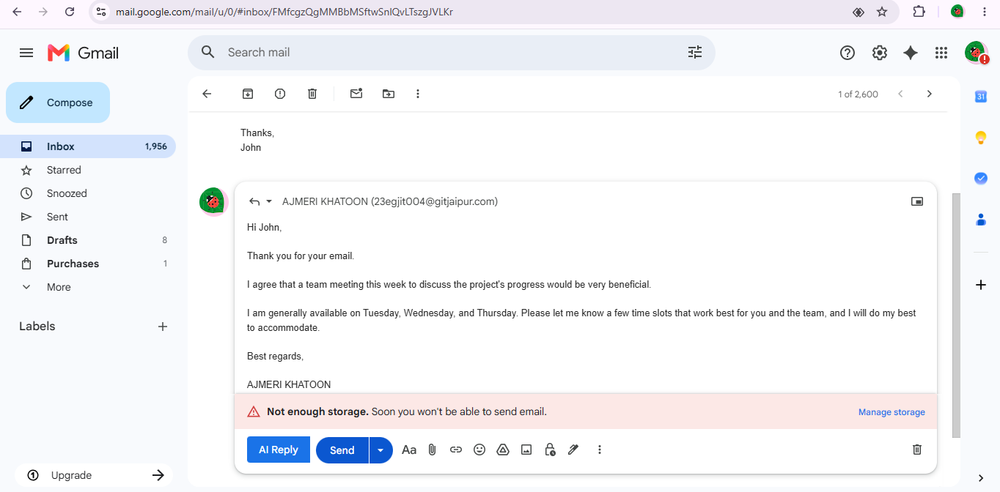

# Email Reply Generator — Chrome Extension 🤖

> A Chrome Extension that integrates directly into Gmail, adding an 
> AI-powered reply button next to the Send button. It connects to the 
> Spring Boot backend to generate smart email replies using Gemini API.

## ✨ Features
- AI Reply button directly inside Gmail
- One-click smart reply generation
- Connected to Spring Boot backend
- Powered by Gemini API

## 🛠️ Tech Stack
| Technology | Use |
|------------|-----|
| JavaScript | Extension Logic |
| Vite | Build Tool |
| Spring Boot | Backend API (Separate Repo ->https://github.com/Ajmerikhatoon549/AIemail-writer) |
| Gemini API | AI Reply Generation |

## 📸 Screenshots

### 📧 AI Reply Button in Gmail

### 💬 Reply Generated

## 🔧 Local Installation
1. Clone this repository
2. Open Chrome → type `chrome://extensions`
3. Enable **Developer Mode** (top right toggle)
4. Click **"Load unpacked"**
5. Select the `dist` folder
6. Open Gmail — AI Reply button dikhega! ✅

> ⚠️ Backend should be running for AI replies to work.
> Check the Web App repo below.

## 🔗 Related Project
[Email Reply Generator — Web App](https://aiemail-writer-xkkz.onrender.com/)
